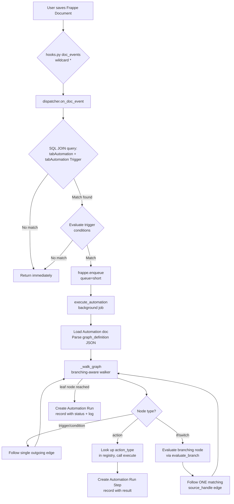
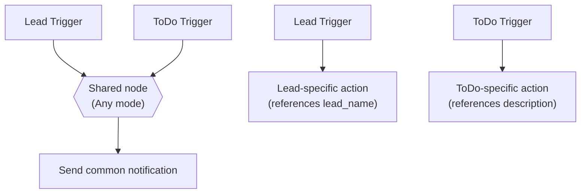

# Automation Builder — Architecture Document

## 1. Problem & Solution

In Frappe, automating business logic currently requires writing Python controller code — overriding `validate()`, `on_update()`, or similar hooks in each DocType's controller file. Every new automation (e.g., "when a Lead reaches Qualified status, create a Follow Up task and send a notification email") requires a developer to write, test, and deploy custom code. This creates a bottleneck: non-technical users cannot create or modify automations, and even developers must touch multiple files for simple workflow changes.

Automation Builder solves this with a visual, no-code workflow builder. Users design automations as graphs: a **Trigger** node (which DocType and event to listen for) connects to a **Condition** node (field/operator/value filter), which connects to one or more **Action** nodes (Create Document, Send Email, HTTP Request, etc.). Branching is supported via **IF** and **Switch** nodes that evaluate conditions and route execution down different paths. The entire graph is saved as JSON (`graph_definition`) on an `Automation` document and executed by a background job when the trigger fires.

The system is designed around a **pluggable registry** — adding a new action or logic type requires only creating a single Python file and registering it. The frontend automatically picks up new types with zero code changes. This is the core architectural thesis: the system scales to new integrations without modifying core dispatcher/executor code.

## 2. System Architecture Overview



### Request lifecycle in detail

1. **Any Frappe document is saved/submitted/cancelled.** Frappe's hooks system fires `doc_events["*"]` handlers.
2. **`hooks.py` registers** `automation_builder.dispatcher.on_doc_event` for `after_insert`, `on_update`, `on_submit`, `on_cancel` on the wildcard `"*"` DocType.
3. **`on_doc_event()`** maps the hook method name to a trigger event string (e.g., `on_update` → `"On Update"`), then runs an indexed SQL query joining `tabAutomation` with `tabAutomation Trigger` to find Published, enabled automations matching the doctype+event. If none found, returns immediately (cheap early exit).
4. **Trigger conditions are evaluated** against the document. If any trigger row's conditions match, the automation is enqueued.
5. **`frappe.enqueue()`** places `execute_automation` on the `"short"` Redis queue for background execution.
6. **`execute_automation()`** loads the Automation doc, parses `graph_definition` JSON, and calls `_walk_graph()` with the document as context.
7. **`_walk_graph()`** walks the graph from the trigger node. For each node:
   - **Action nodes**: Looks up the `action_type` in the registry, calls its `execute()` function with the context document and config.
   - **IF/Switch nodes**: Calls `evaluate_branch()` to determine which output handle to follow, then follows only that one edge.
   - **Trigger/Condition nodes**: Follows the single outgoing edge.
8. **Each step creates an `Automation Run Step` record** (branch decisions and action results).
9. **The walk continues** until a leaf node is reached (no outgoing edges).
10. **An `Automation Run` record** is created with overall status, JSON log, and child step records.

## 3. Data Model

### DocTypes

**Automation** (parent, named by `automation_name` field)

| Field | Type | Purpose |
|-------|------|---------|
| `automation_name` | Data (unique) | Human-readable name, used as document name |
| `status` | Select: Draft/Published | Governance state — only Published automations execute |
| `enabled` | Check | Kill switch — disabled automations never dispatch |
| `triggers` | Table → Automation Trigger | Child table defining trigger doctype, event, and conditions |
| `graph_definition` | Code (JSON) | The visual graph: `{nodes: [...], edges: [...]}` |
| `description` | Small Text | Optional documentation |
| `trigger_doctype` | Link (hidden) | Legacy field, migrated to triggers table |
| `trigger_event` | Select (hidden) | Legacy field, migrated to triggers table |
| `condition_field` | Data (hidden) | Legacy field, migrated to triggers table |
| `condition_operator` | Select (hidden) | Legacy field, migrated to triggers table |
| `condition_value` | Data (hidden) | Legacy field, migrated to triggers table |
| `workflow_json` | Code (hidden) | Legacy field, migrated to graph_definition |

Permissions: System Manager (full CRUD), Automation User (read/write/create, no delete).

**Automation Trigger** (child table of Automation)

| Field | Type | Purpose |
|-------|------|---------|
| `trigger_doctype` | Link → DocType | Which DocType to listen to |
| `trigger_event` | Select: After Insert/On Update/On Submit/On Cancel | Which document event |
| `condition_logic` | Select: All must match/Any must match | How conditions within this trigger row are combined |
| `conditions` | Table → Automation Trigger Condition | Nested conditions (AND/OR groups) |
| `condition_field` | Data (hidden) | Legacy field, migrated to conditions table |
| `condition_operator` | Select (hidden) | Legacy field, migrated to conditions table |
| `condition_value` | Data (hidden) | Legacy field, migrated to conditions table |

**Cross-doctype triggers:** An Automation can have multiple trigger rows targeting different DocTypes (e.g., Lead + ToDo). Trigger rows use OR semantics — ANY matching row fires the automation. When a Lead is inserted, only the Lead trigger row's conditions are evaluated against the Lead document. The ToDo trigger row's conditions are also evaluated but would typically fail (the Lead doesn't have ToDo fields). This design means:

- **Dispatch**: `on_doc_event` queries automations where `trigger_doctype` matches the event's doctype. Only automations with a matching trigger row are considered.
- **Condition evaluation**: All trigger rows are evaluated against the same document (the one that triggered the event). Conditions that reference fields from a different doctype will evaluate to False.
- **Actions**: Actions operate on `context["doc"]` — the document that triggered the event. Cross-doctype operations (e.g., updating a Lead when a ToDo triggers) use "Linked Document" in the Update Field action.
- **Token resolution**: `{{trigger.fieldname}}` resolves against the triggering document. `{{trigger_<doctype>.fieldname}}` is also supported for explicit doctype targeting (resolves against the same document for now).Future enhancement: `context["trigger_docs"]` could hold documents from all matching triggers for true cross-doctype token resolution.

**`trigger_doctype_select` config field on actions:** When an automation has multiple triggers, the Update Field and Create Document actions include a `trigger_doctype_select` dropdown with three modes:

1. **Specific doctype** (e.g., "Lead"): The action operates on that doctype's fields. Field mapping shows that doctype's fields.
2. **"Any (whichever triggered)"**: The action operates on whatever document actually fired this run. Tokens resolve against that document. Fields that don't exist on the triggering doctype resolve to empty string (no error). Use this when two branches from different trigger doctypes converge into a single shared downstream node that only uses common fields.
3. **Empty (default)**: Falls back to the first trigger doctype.

**"Any" mode vs. "duplicate the node per branch":** When should you use "Any" mode versus duplicating the action node for each trigger doctype?

- **Use "Any" mode** when the shared node uses only fields that exist on ALL trigger doctypes (common fields). Example: a notification node that sends `{{trigger.name}}` — the `name` field exists on every Frappe document. Missing fields gracefully resolve to empty string.
- **Duplicate the node per branch** when each doctype needs different field references or different logic. Example: Lead-specific actions reference `lead_name`, `company`, `email_id`; ToDo-specific actions reference `description`, `assigned_to`. These fields don't overlap, so duplicating the node with doctype-specific config is clearer and avoids empty-token confusion.



**Automation Run** (read-only, autonamed by hash)

| Field | Type | Purpose |
|-------|------|---------|
| `automation` | Link → Automation | Which automation was executed |
| `reference_doctype` | Data | DocType of the triggering document |
| `reference_name` | Dynamic Link | Name of the triggering document |
| `status` | Select: Success/Failed/Skipped | Overall execution result |
| `started_at` | Datetime | When execution began |
| `ended_at` | Datetime | When execution completed |
| `log` | Long Text | JSON array of step results (human-readable) |
| `steps` | Table → Automation Run Step | Structured per-step records |
| `error` | Long Text | Stack trace if execution failed |

**Automation Run Step** (child table of Automation Run, `istable: 1`)

| Field | Type | Purpose |
|-------|------|---------|
| `node_id` | Data | Graph node ID (e.g., `"if-1"`, `"action-1234"`) |
| `node_type` | Select: trigger/condition/action/if/switch | Node type in the graph |
| `step_type` | Data | Action type key (e.g., `"send_email"`) or `"if"`/`"switch"` |
| `status` | Select: Success/Failed/Skipped | Step result |
| `branch_taken` | Data | For branching nodes: which handle was followed (e.g., `"if-true"`, `"case-0"`, `"default"`) |
| `output` | Long Text | Human-readable result (e.g., `"IF status = 'Open' -> TRUE"`) |
| `error` | Long Text | Error message if step failed |

**Automation Task** (standalone, used as a test target since ERPNext is not installed)

| Field | Type | Purpose |
|-------|------|---------|
| `subject` | Data (required) | Task subject |
| `status` | Select: Open/Working/Completed/Cancelled | Task status |
| `priority` | Select: Low/Medium/High/Urgent | Task priority |
| `linked_doctype` | Data | DocType of linked document |
| `linked_document` | Dynamic Link | Name of linked document |
| `description` | Small Text | Task description |

**Automation Email Template** (standalone, named by `template_name`)

| Field | Type | Purpose |
|-------|------|---------|
| `template_name` | Data (unique) | Template name |
| `subject` | Data (required) | Email subject |
| `body` | Code (HTML) | Email body with HTML support |

**Automation Builder Settings** (single DocType)

| Field | Type | Purpose |
|-------|------|---------|
| `telegram_bot_token` | Data | Telegram Bot API token; if blank, Telegram actions run in mock mode |

### Entity-Relationship Diagram

```mermaid
erDiagram
    Automation ||--o{ Automation Trigger : "has triggers"
    Automation ||--o{ Automation Run : "produces runs"
    Automation Run ||--o{ Automation Run Step : "has steps"
    Automation }o--|| Automation Builder Settings : "reads telegram token"
    Automation Email Template }o--o| Automation : "optional template"

    Automation {
        string automation_name UK
        string status
        int enabled
        text graph_definition
        text description
    }

    Automation Trigger {
        string trigger_doctype
        string trigger_event
        string condition_field
        string condition_operator
        string condition_value
    }

    Automation Run {
        string automation FK
        string reference_doctype
        string reference_name
        string status
        datetime started_at
        datetime ended_at
        text log
        text error
    }

    Automation Run Step {
        string node_id
        string node_type
        string step_type
        string status
        string branch_taken
        text output
        text error
    }
```

## 4. Execution Engine

### Graph Model

The automation graph is stored as a JSON string in `Automation.graph_definition` with this structure:

```json
{
  "nodes": [
    {"id": "trigger", "type": "trigger", "position": {"x": 250, "y": 50}, "data": {"trigger_doctype": "ToDo", "trigger_event": "On Update"}},
    {"id": "if-1", "type": "if", "position": {"x": 250, "y": 250}, "data": {"field_to_check": "status", "operator": "=", "value": "Open"}},
    {"id": "action-1", "type": "action", "position": {"x": 100, "y": 450}, "data": {"action_type": "send_email", "recipient": "..."}},
    {"id": "action-2", "type": "action", "position": {"x": 400, "y": 450}, "data": {"action_type": "telegram", "chat_id": "..."}}
  ],
  "edges": [
    {"source": "trigger", "target": "if-1", "sourceHandle": "trigger-out", "targetHandle": "if-in"},
    {"source": "if-1", "target": "action-1", "sourceHandle": "if-true", "targetHandle": "action-1-in"},
    {"source": "if-1", "target": "action-2", "sourceHandle": "if-false", "targetHandle": "action-2-in"}
  ]
}
```

**Node types currently implemented:**
- `trigger` — entry point, always exactly one per graph
- `condition` — field/operator/value filter (legacy; preserved for backward compatibility)
- `action` — side-effect node (Create Document, Send Email, HTTP Request, Telegram, Update Field)
- `if` — branching node with 2 output handles (`if-true`, `if-false`)
- `switch` — branching node with N output handles (`case-0` through `case-N`, plus `default`)

**Edges carry `sourceHandle` and `targetHandle`** which identify which specific handle on each node the connection uses. This is critical for branching nodes: an IF node has two source handles (`if-true` and `if-false`), and each edge's `sourceHandle` determines which branch it represents.

### Graph Walking

The `_walk_graph()` function in `dispatcher.py` implements a **single-path walk** (not BFS). Starting from the `"trigger"` node, it follows edges one node at a time:

- **Non-branching nodes** (trigger, condition, action): Follows the single outgoing edge.
- **Branching nodes** (if, switch): Evaluates the node via `evaluate_branch()`, which returns a `source_handle` string. Only the edge whose `sourceHandle` matches is followed.

When `context` is `None` (structural walk for UI validation), the walker follows the first outgoing edge of every node. When `context` is provided (execution), branching evaluation is active.

The walk produces a **trace** — an ordered list of entries like `[{"type": "branch", "node_id": "if-1", "branch_taken": "if-true", ...}, {"type": "action", "node_id": "action-1"}]`. This trace preserves execution order and is used to create Automation Run Step records.

**What is NOT supported yet:**
- **Parallel execution** — the walker follows a single path, not all branches simultaneously
- **Merge nodes** — there is no concept of multiple branches converging back into a single path
- **Loops/cycles** — the walker uses a `seen` set to prevent infinite loops; cycles are silently skipped

### Background Execution

`execute_automation()` runs as a `frappe.enqueue()` background job on the `"short"` Redis queue. This is necessary because:
1. Action types like `create_document` call `doc.insert()` which triggers further hooks — running inline would cause recursion
2. HTTP Request and Telegram actions involve network I/O that shouldn't block the web request
3. The re-entry guard (`frappe.flags["_automation_running_{doctype}_{name}"]`) prevents infinite trigger loops when an action saves a document that would re-trigger the same automation (added Stage 15-16, `804264c`)

## 5. The Extensibility Model

This is the core architectural thesis of the project. The action/logic type registry is designed so that **adding a new node type requires exactly one new Python file and zero changes to core dispatcher, executor, or frontend code**.

### How the Registry Works

The registry is a plain Python dict (`ACTION_TYPES`) in `action_types/__init__.py`. Each entry is registered via `register_action_type()` with this signature:

```python
register_action_type(
    key,                    # unique string identifier
    label,                  # human-readable name
    config_schema,          # list of field definitions for the config panel
    execute_fn=None,        # for action types: (context, config) -> result dict
    node_category="action", # "action" or "logic"
    output_handles=None,    # for logic types: static list or "dynamic"
    evaluate_branch=None,   # for logic types: (config, context) -> (handle, log_msg)
    get_output_handles=None,# for dynamic logic types: (config) -> handle list
)
```

The `node_category` field distinguishes between two kinds of nodes:
- **`"action"`** — has side effects (creates docs, sends emails, etc.), always continues to a single next node. Must provide `execute_fn`.
- **`"logic"`** — has no side effects, determines which edge to follow next. Must provide `evaluate_branch`.

Both categories live in the **same registry** because they share the same interface: `key`, `label`, `config_schema`, and `node_category`. The frontend fetches all types via a single `get_action_types()` API call and uses `node_category` to render them in different palette sections.

### Why One Registry Instead of Two

A faculty reviewer might ask: "Why not create a separate `LOGIC_TYPES` registry?" The answer is structural, not incidental:

1. **Single lookup path.** `get_action_type(key)` works for both action and logic types. The dispatcher doesn't need to know which category a type belongs to before looking it up — it just calls `get_action_type()` and checks for `execute` vs `evaluate_branch`.

2. **Single API endpoint.** `get_action_types()` returns all types with their `node_category`. The frontend iterates this one list and groups by category. A separate registry would require a separate API endpoint, separate frontend loading, and separate palette rendering.

3. **Shared interface.** Both categories need `key`, `label`, `config_schema`. The only difference is behavior (`execute` vs `evaluate_branch`). Extending one dict with optional fields is simpler than maintaining two parallel dicts with overlapping schemas.

4. **Future extensibility.** If a third category were needed (e.g., `"transform"` nodes that modify data without side effects or branching), it would be another `node_category` value in the same registry — not a third parallel dict.

### Worked Example: Adding a New Action Type

Below is the actual `http_request.py` file (verbatim, 152 lines). This is a real action type that exists in the codebase — the worked example is the real file, not a simplified fiction.

**Step 1: Create `automation_builder/action_types/http_request.py`**

```python
"""HTTP Request action type — makes an HTTP call to any URL.

This module also exposes ``make_http_request()`` as a reusable helper so that
other action types (e.g. Telegram) can issue HTTP calls without duplicating
the request-building, error-handling, and logging logic.
"""

import json
from urllib.parse import urlencode

import frappe
import requests as _requests

from automation_builder.action_types import register_action_type
from automation_builder.action_types._helpers import resolve_value

CONFIG_SCHEMA = [
    {
        "name": "url",
        "type": "data",
        "label": "URL",
        "description": "Full URL. Supports {{trigger.fieldname}} tokens.",
    },
    {
        "name": "method",
        "type": "select",
        "label": "Method",
        "options": ["GET", "POST", "PUT", "PATCH", "DELETE"],
    },
    {
        "name": "headers",
        "type": "field_mapping_table",
        "label": "Headers",
        "description": "Optional HTTP headers (key/value). Supports {{trigger.fieldname}} in values.",
    },
    {
        "name": "body",
        "type": "textarea",
        "label": "Body",
        "description": "Request body (sent as JSON for POST/PUT/PATCH). Supports {{trigger.fieldname}} tokens.",
    },
]


# ---------------------------------------------------------------------------
# Shared helper — used by http_request.execute() and telegram.py
# ---------------------------------------------------------------------------
def make_http_request(method, url, headers=None, body=None, json_payload=None, timeout=30):
    """Issue an HTTP request and return a result dict.

    Args:
        method: HTTP method string (GET, POST, ...).
        url: Full URL.
        headers: Optional dict of request headers.
        body: Optional string body.  Parsed as JSON when possible.
        json_payload: Optional dict to send as JSON body (takes precedence
            over *body* for POST/PUT/PATCH).
        timeout: Request timeout in seconds.

    Returns:
        dict with keys: status_code, response_body (truncated), ok (bool).

    Raises:
        requests.exceptions.RequestException on connection errors.
    """
    headers = headers or {}
    method = (method or "GET").upper()

    kwargs = {"headers": headers, "timeout": timeout}

    if method in ("POST", "PUT", "PATCH"):
        if json_payload is not None:
            kwargs["json"] = json_payload
        elif body is not None:
            # Attempt to parse as JSON; fall back to raw text
            try:
                kwargs["json"] = json.loads(body)
            except (json.JSONDecodeError, TypeError):
                kwargs["data"] = body

    resp = _requests.request(method, url, **kwargs)

    # Truncate response body for logging (keep first 2000 chars)
    resp_text = resp.text[:2000] if resp.text else ""

    return {
        "status_code": resp.status_code,
        "response_body": resp_text,
        "ok": resp.ok,
    }


# ---------------------------------------------------------------------------
# Action type execute
# ---------------------------------------------------------------------------
def execute(context, config):
    """Make an HTTP request to the configured URL.

    config format::

        {
            "url": "https://example.com/api",
            "method": "POST",
            "headers": [{"target_field": "Content-Type", "source_value": "application/json"}],
            "body": '{"key": "{{trigger.lead_name}}"}'
        }

    Raises on failure — the exception propagates to the dispatcher which
    marks the Automation Run as Failed with the real traceback.
    """
    url = resolve_value(config.get("url", ""), context)
    method = config.get("method", "GET")
    body_raw = config.get("body", "")

    if not url:
        raise ValueError("No URL specified in http_request action config")

    # Resolve token placeholders in body
    body = resolve_value(body_raw, context) if body_raw else None

    # Build headers dict from field_mapping_table rows
    raw_headers = config.get("headers", [])
    headers = {}
    for row in raw_headers:
        key = resolve_value(row.get("target_field", ""), context)
        val = resolve_value(row.get("source_value", ""), context)
        if key:
            headers[key] = val

    result = make_http_request(method, url, headers=headers, body=body)

    status_code = result["status_code"]
    resp_preview = result["response_body"]

    if not result["ok"]:
        raise ValueError(
            f"HTTP {method} {url} returned status {status_code}: {resp_preview}"
        )

    return {
        "step_type": "http_request",
        "status": "Success",
        "output": f"HTTP {method} {url} → {status_code}\n{resp_preview}",
    }


register_action_type(
    key="http_request",
    label="HTTP Request",
    config_schema=CONFIG_SCHEMA,
    execute_fn=execute,
)
```

**Step 2: Import it in `action_types/__init__.py`**

Add one line at the bottom:

```python
from automation_builder.action_types import http_request  # noqa: E402, F401
```

That's it for the backend. The `register_action_type()` call at module load time adds the type to `ACTION_TYPES`.

**Step 3: Frontend picks it up automatically**

The `get_action_types()` API endpoint calls `get_all_action_types()` which returns the new type with its `config_schema`. The frontend's `ConfigPanel.vue` already renders config panels generically from `config_schema` — it handles `data`, `select`, `textarea`, `field_mapping_table`, `template_picker`, `doctype_link`, `link_field_select`, `field_select`, and `case_list` field types. If your new type uses only these existing field types, the config panel renders correctly with zero frontend changes.

**Step 4: It appears in the palette automatically**

`NodePalette.vue` calls `getActionTypes()` on mount and renders all returned types under the "Actions" section (those with `node_category !== 'logic'`). The new type appears with a generic document icon and its label.

**The total cost of adding this action type:** One new Python file (the real `http_request.py` above is ~150 lines because it includes a shared `make_http_request()` helper — a minimal action type is ~30 lines), one import line in `__init__.py`. Zero changes to `dispatcher.py`, `executor.py`, `api.py`, `ConfigPanel.vue`, `ActionConfigForm.vue`, `AutomationBuilder.vue`, or `NodePalette.vue`.

### How IF/Switch Fit the Same Registry

IF and Switch use the same `register_action_type()` but with `node_category="logic"` instead of `"action"`:

```python
# In if_condition.py:
register_action_type(
    key="if_condition",
    label="IF",
    config_schema=CONFIG_SCHEMA,
    node_category="logic",          # distinguishes from action types
    output_handles=OUTPUT_HANDLES,   # static: [{"id": "if-true", ...}, {"id": "if-false", ...}]
    evaluate_branch=evaluate_branch, # (config, context) -> (handle, log_msg)
)

# In switch_case.py:
register_action_type(
    key="switch_case",
    label="Switch",
    config_schema=CONFIG_SCHEMA,
    node_category="logic",
    output_handles="dynamic",        # handles depend on configured cases
    evaluate_branch=evaluate_branch,
    get_output_handles=get_output_handles,  # (config) -> handle list
)
```

The dispatcher's `_evaluate_branching_node()` calls `get_action_type("if_condition")` or `get_action_type("switch_case")` and invokes their `evaluate_branch` function. This is the same `get_action_type()` call used for action types — no separate lookup mechanism.

The frontend uses `node_category` to:
- Show IF/Switch in the "Logic" section of the palette (purple icons) vs. "Actions" (green icons)
- Render them with different node templates (multi-handle output vs. single-handle)
- Skip the add-trigger connection logic (branching nodes connect manually from handles)

## 6. Governance & Permissions

### Draft/Published State

Every Automation starts as `Draft` and must be explicitly published to become active. The dispatcher query filters on `status = 'Published'` — Draft automations are invisible to the execution engine. This prevents incomplete or experimental automations from firing on live data.

### Role-Based Permissions

Two roles control access:

- **System Manager**: Full CRUD on Automation, can publish, can delete. Also read-only on Automation Run.
- **Automation User**: Read/write/create on Automation, cannot publish, cannot delete. No access to Automation Run.

The publish check is enforced **server-side** in two places:
1. `api.py` `save_automation()`: If `status == "Published"` and the user doesn't have "System Manager" role, it throws an error.
2. `api.py` `can_publish()`: Returns a boolean that the frontend uses to disable the Published button for non-System Manager users.

The frontend calls `canPublish()` on mount and disables the Published toggle button if the user lacks permission. This is a UI convenience — the server-side check is the actual enforcement.

## 7. Frontend Architecture

### Technology Stack

- **Vue 3** with Composition API (`<script setup>`)
- **Vue Flow** (`@vue-flow/core`) for the visual node graph canvas
- **Vite** for bundling, output to `automation_builder/public/`
- **Vue Router** for navigation between list/builder/runs views

### How It's Served

The frontend is a single-page application embedded in Frappe Desk via the Page mechanism:

1. `spa_builder.json` defines a Frappe Page at `/app/spa-builder`
2. `spa_builder.js` runs on page load: creates a `<div id="automation-builder-app">`, injects the CSS (with cache-busting query parameter), and loads the compiled JS bundle via `frappe.require()`
3. The Vue app auto-mounts to `#automation-builder-app` via `main.js`
4. Vue Router handles three routes: automation list, builder canvas, run history

### Schema-Driven Config Panel

The config panel (`ConfigPanel.vue`) renders configuration forms generically from `config_schema` — it doesn't know about specific action types. The schema defines fields with types like:

- `data` → text input
- `textarea` → multi-line text
- `select` → dropdown with fixed options
- `doctype_link` → dropdown of all DocTypes
- `link_field_select` → dropdown of Link fields from the trigger doctype
- `field_select` → dropdown of any field from the trigger doctype
- `field_mapping_table` → repeatable target_field/source_value rows
- `template_picker` → dropdown of Automation Email Templates
- `case_list` → dynamic list of case values (for Switch nodes)
- `trigger_doctype_select` → dropdown of trigger doctypes from the automation (for multi-trigger cross-doctype actions)

When a user selects a new action type, `onActionTypeChange()` initializes the config from the schema's defaults. The `ActionConfigForm.vue` component handles rendering each field type and emitting config updates.

### Canvas Graph ↔ `graph_definition` Mapping

**On save** (`save()` in `AutomationBuilder.vue`):
- Filters out the `add-trigger` placeholder node
- Serializes `nodes` and `edges` as JSON
- Saves as `graph_definition` on the Automation doc
- Also builds a `triggers` array from the trigger node's data for the child table

**On load** (`onMounted` in `AutomationBuilder.vue`):
- Parses `graph_definition` JSON
- Restores nodes and edges to Vue Flow
- Adds an `add-trigger` placeholder node at the bottom of the graph
- Connects the last action node to the placeholder

## 8. Testing Approach

### Automated Tests (49 total, all passing)

All tests use `frappe.tests.IntegrationTestCase` and run against a real MariaDB database.

**`test_migration_patch.py`** (7 tests) — Verifies the standalone migration script (`migrate_17a.py`) correctly migrates legacy fields to the new schema.

**`test_graph_traversal.py`** (8 tests) — Tests the legacy BFS graph walker (`_walk_graph_bfs`) and `_extract_actions_from_graph()` for structural graph traversal.

**`test_17b_verify.py`** (14 tests) — Governance (Draft vs Published dispatch), UI permission gating (`can_publish()`), graph schema interaction (drag-to-add, sidebar DnD, mid-chain removal), full-path integration tests (dispatch query, condition match/no-match), and real hooks integration test.

**`test_18_branching.py`** (20 tests) — Registry verification (IF/Switch registered correctly), IF branch selection (true/false, operators), Switch branch selection (case match, default, empty field), full execution with branching (Automation Run + Run Step records), mid-chain removal re-check (3 scenarios), graph save/load roundtrip with branching nodes.

### What Is NOT Covered by Automated Tests

- **Live browser canvas interactions** — Vue Flow's drag-and-drop, handle connections, and node positioning cannot be reliably tested headlessly. The canvas rendering (node appearance, handle visibility, edge routing) requires visual inspection.
- **Email sending** — `send_email` actions fail in the test environment (no email account configured). Tests that exercise email paths verify the action doesn't crash, not that an email is actually delivered.
- **Telegram sending** — Tests use mock mode (no bot token configured) or accept that Telegram returns an error for non-existent chat IDs.
- **HTTP Request** — Tests verify the action executes without crashing but don't make real HTTP calls.
- **Dark mode rendering** — CSS theme switching requires visual verification.
- **The `add-trigger` placeholder node behavior** — The automatic reconnection of the placeholder after node addition/removal is assumed correct from the graph definition roundtrip tests but not visually verified.

## 9. Current Scope vs. Full Roadmap

### What Is Built (as of Stage 22)

| Feature | Status |
|---------|--------|
| Automation DocType with Draft/Published governance | ✅ |
| Automation Trigger child table (multi-trigger support) | ✅ |
| Cross-doctype triggers (Lead + ToDo + Note, OR across rows) | ✅ |
| AND/OR condition groups per trigger row | ✅ |
| Visual graph canvas (Vue 3 + Vue Flow) | ✅ |
| 5 action types: Create Document, Send Email, HTTP Request, Telegram, Update Field | ✅ |
| 2 logic types: IF (2 branches), Switch (N branches + default) | ✅ |
| Background execution via `frappe.enqueue()` | ✅ |
| Re-entry guard preventing infinite trigger loops | ✅ |
| Per-step execution logging (Automation Run + Run Step) | ✅ |
| Pluggable registry (add types with zero core changes) | ✅ |
| Schema-driven config panel (generic rendering from config_schema) | ✅ |
| Automation User role + permission gating | ✅ |
| Sidebar node palette with drag-and-drop | ✅* |
| Drag-to-add picker (from handle to empty canvas) | ✅* |
| Node type picker (drag-to-empty-canvas) | ✅* |
| Security hardening (denylist, SSRF protection, XSS sanitization) | ✅ |
| 105 automated tests (0 fail) | ✅ |

\* Backend logic verified by automated test (graph roundtrip, reconnection after removal); live browser interaction not independently confirmed by a human. See Section 8 for full gaps list.

### What the Full Roadmap Includes (Not Yet Built)

| Feature | Roadmap Phase |
|---------|---------------|
| Error handling / retry / branching on failure | Future |
| Parallel execution (fan-out) | Future |
| Merge nodes (fan-in) | Future |
| Execution history UI with per-step visualization | Future |
| Template library (pre-built automation patterns) | Future |
| Webhook trigger (external HTTP → automation) | Future |
| Cron/scheduled triggers (time-based) | Future |
| Custom node plugin API (user-defined types at runtime) | Future |
| Audit trail / change logging | Future |

The architecture is designed to accommodate all of these. The registry pattern means new trigger types, action types, and logic types can be added without touching core code. The graph model supports future parallel/merge nodes by extending the walker. The step logging infrastructure supports future per-step visualization.

## 10. Known Limitations & Honest Caveats

1. **No parallel execution.** The graph walker follows a single path. If a user creates a graph where an IF node's true and false branches both lead to independent actions, only one branch executes. There is no fan-out mechanism.

2. **No merge nodes.** Two branches that should converge into a single downstream action cannot be represented correctly. The walker would need a "wait for all incoming branches" concept that doesn't exist yet.

3. **Canvas interactions are not automated.** The visual graph builder (drag-and-drop, handle connections, node positioning, config panel rendering) has no automated tests. These require browser-based testing (e.g., Playwright) which is not set up.

4. **Switch handles may need `updateNodeInternals()`.** When the user adds or removes cases in the Switch config panel, the Vue Flow handles change dynamically. Vue Flow may need to be notified via `updateNodeInternals()` to correctly render connections. This has not been visually verified in a live browser.

5. **The `condition` node type is functionally redundant with IF.** The original `condition` node (from Stage 1-3) evaluates a field/operator/value but has only one output. The IF node does the same evaluation but with two outputs (true/false). Both exist for backward compatibility — existing automations use the `condition` node type. A future cleanup could deprecate it.

6. **Legacy fields on Automation are hidden but not removed.** The `trigger_doctype`, `trigger_event`, `condition_field`, `condition_operator`, `condition_value`, and `workflow_json` fields still exist on the Automation DocType (marked `hidden: 1`). They were migrated to `triggers` table and `graph_definition` but are kept for backward compatibility.

7. **The re-entry guard uses `frappe.flags` which is per-request.** If two background jobs for the same document run simultaneously (unlikely with `"short"` queue but theoretically possible), the guard might not prevent both from executing. The guard key is `_automation_running_{doctype}_{name}`. Added in Stage 15-16 (`804264c`); was never reported in any progress update — discovered via source inspection during this document review.

8. **Telegram mock mode output is clear but indistinguishable in Automation Run status.** When no bot token is configured, the `execute()` function returns `status: "Success"` with output `"MOCK MODE (no Telegram bot token configured): would have sent to chat_id=...`. The `MOCK MODE` prefix is unambiguous in the Run Step `output` field, but the Run itself is marked `Success` — there is no separate `Mocked` or `Partial` status to distinguish a real send from a mock at the Run level.

9. **No undo/redo on the canvas.** The Vue Flow canvas does not implement undo/redo. Users must manually reconnect nodes if they make a mistake.

10. **The `add-trigger` placeholder node is a hack.** The bottom-of-graph "+" button for adding new actions is implemented as a special node type (`add-trigger`) that gets repositioned and reconnected whenever the graph changes. A cleaner approach would be a canvas-level UI control rather than a graph node.
